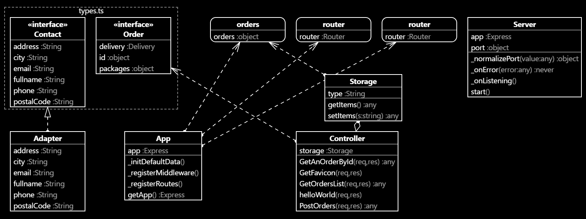

# TP n°2 COO - ISEN AP5
# Réponses aux questions du TP

## Question 2

J'ai choisi d'utiliser le patern d'architecture MVC car c'est celui que l'on a vu en cours, et je n'en ai jamais utilisé d'autre... :)

Sinon :
- C'est un patern très utilisé et populaire pour les web app
- Il permet de bien organiser son code source en plusieurs parties tout en connaissant le rôle précis de chacune (vue / contrôleur). Pour coder en équipe c'est pratique !
- Il est supporté par de nombreux langages de programmation

## Question 3

Ici, on utilise le I du principe SOLID (Liskov substitution principle).
On doit pouvoir remplacer une instance d'un type par une instance d'un autre sous-type sans que cela impacte notre projet et la cohérence du programme.

## Question 4

Afin que chaque information présente dans la partie contact soit anonyme, on peut utiliser un Adapter (ou Adaptateur) :
[Adapter refactoring](https://refactoring.guru/fr/design-patterns/adapter)
Ce design pattern permet à des classes de collaborer alors qu'elles n'auraient pas pu le faire à cause d'interfaces incompatibles.
Ainsi, on va pouvoir mettre des données par défaut pour la partie contact.

## Question 5

On utilise le module npm node-persist :
[node-persist](https://www.npmjs.com/package/node-persist)
Il nous permet d'utiliser les fonctions de base setItem et getItem

## Question 6

Image générée directement via VSCode grâce à l'extension classdiagram-ts, des génies.

